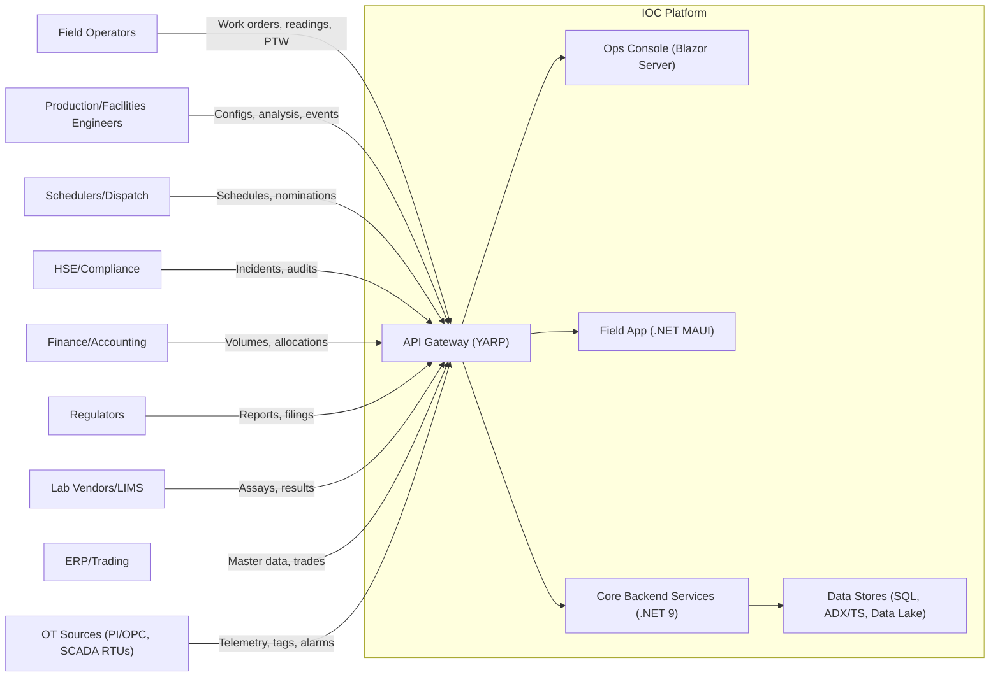

# C4 — Context Diagram

Notes

- Multi-tenant (company/site/asset) isolation enforced at gateway and service layers.
- All quantities in ISO units (e.g., m³, kg, Pa). Non-ISO entry points note conversions.

