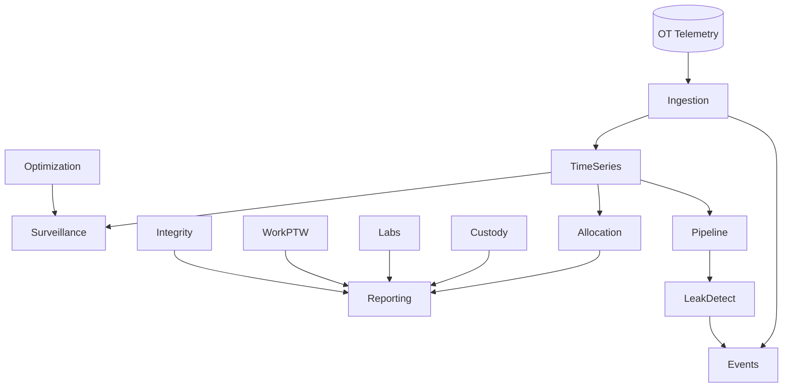

# Domain Map & Bounded Contexts

This document defines bounded contexts, ownership, change cadence, SLAs, and coupling styles. Arrows indicate upstream (publishes events) to downstream (consumes) relationships.

## Contexts Overview

- Tenancy: multi-company → multi-site → multi-asset hierarchy. Each context enforces tenant boundary.

## Context Details

1. Ingestion
   - Ownership: Data Platform
   - Change cadence: Medium
   - SLA: 99.9% availability; backpressure up to 500k msgs/min/event hub
   - Coupling: Event-first (Event Hubs), idempotent ingestion

2. Time-Series Management
   - Ownership: Data Platform
   - Change cadence: Medium
   - SLA: P99 query < 2s for 24h windows, retention hot: 90 days
   - Coupling: Event-ingest; API for downsampling and feature windows

3. Allocation (Production Allocation & Balancing)
   - Ownership: Production Engineering
   - Change cadence: Medium
   - SLA: Daily close by 10:00 local; P99 compute < 15 min for 10k wells
   - Coupling: Consumes time-series events; publishes `AllocationClosed`, `FactorUpdated`

4. Lift Optimization & Surveillance
   - Ownership: Production Engineering
   - Change cadence: High
   - SLA: P99 recommendation latency < 10s from new data
   - Coupling: Event-driven inputs; API for actuation approvals

5. Events & Alarms
   - Ownership: Operations
   - Change cadence: Medium
   - SLA: P99 alarm fan-out < 2s; audit immutable
   - Coupling: Event router via Event Hubs; API for acknowledgements

6. Work Management & PTW
   - Ownership: Operations
   - Change cadence: Medium
   - SLA: 99.9%; offline-capable sync for field app
   - Coupling: API primary; publishes `WorkOrderCompleted`, `PermitApproved`

7. Integrity Management
   - Ownership: Integrity/Facilities
   - Change cadence: Low
   - SLA: Inspection data availability < 1h; evidence retention 7 years
   - Coupling: API + events for findings and mitigations

8. Pipeline Ops & Leak Detection
   - Ownership: Pipeline Operations
   - Change cadence: Medium
   - SLA: Leak detection P99 < 30s; false-positive < 2% monthly
   - Coupling: Event-driven with time-series; API for control-room views

9. Custody Transfer & Proving
   - Ownership: Measurement
   - Change cadence: Medium
   - SLA: Meter proving posted < 1h; ticket immutability
   - Coupling: API; publishes `ProvingCompleted`, `TicketIssued`

10. Labs Integration
    - Ownership: Quality/Labs
    - Change cadence: Medium
    - SLA: Lab results within 24h; schema evolution supported
    - Coupling: API with vendor-specific adapters; events on `AssayReceived`

11. Reporting & Compliance
    - Ownership: Compliance/Finance
    - Change cadence: Low
    - SLA: Regulatory filing deadlines met; report generation P95 < 30s
    - Coupling: Read models across SQL/Lake; event subscriptions for closures

12. Digital Twin (Model Registry & Graph)
    - Ownership: Data Science/Architecture
    - Change cadence: Medium
    - SLA: Model serve P99 < 200ms per inference (cached)
    - Coupling: Event-driven feature updates; API for graph queries

## Upstream/Downstream Contracts

- Prefer event coupling where latency tolerance allows.
- Use API coupling for commands requiring immediate validation/authorization.
- Enforce versioned event schemas and consumer-driven contracts.

## SLAs/SLO Hints by Context

- Availability: 99.9% most contexts; 99.95% for Events, Gateway.
- RTO/RPO: see `docs/nfrs.md` for quantified targets.

